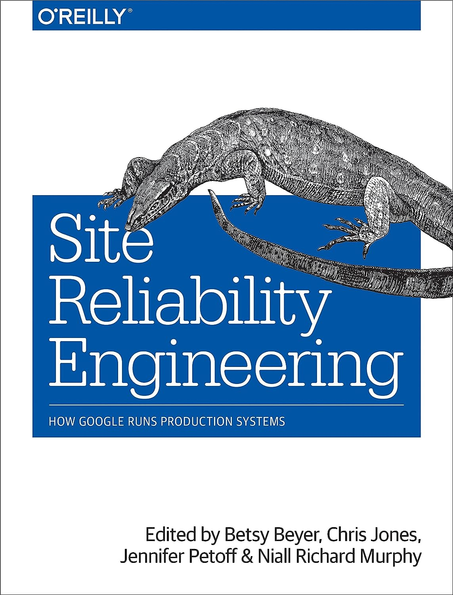

<!-- _class: title -->
# SRE原則
## サイト信頼性エンジニアリング

---

## アジェンダ

1. SREの概要
2. 7つの主要な原則
3. 各原則の詳細と実例
4. まとめ

---

## SREの概要

- Googleが提唱
- **目標**: サービスの高い利用可能性を保ちつつ、変更を迅速にリリース
- ソフトウェアエンジニアリングの手法とオペレーションのベストプラクティスを融合

---

## 7つの主要な原則

1. **サービスレベルの目標とエラーバジェット**
2. **自動化**
3. **小さな変更を頻繁に**
4. **自己回復力のあるシステムを目指す**
5. **緊急時の対応を自動化**
6. **アーキテクチャを簡潔に**
7. **エンジニアがオペレーションに携わる**

---

## サービスレベルの目標とエラーバジェット

- 品質を明確に測定
- 許容可能なエラーレベルを定義
- 変更とリスクをバランス

**例**: eコマースサイトが月99.9%のアップタイムを目指す。これにより、月に約43分のダウンタイムが許容される。

---

## 自動化

- 手動作業の削減
- エンジニアの効率と生産性の向上

**例**: サーバーの負荷が一定以上になった場合、新しいインスタンスを自動で追加するクラウドルールの設定。

---

## 小さな変更を頻繁に

- リスクの軽減
- 高速なフィードバックループを実現

**例**: マイクロサービスを活用し、小さな機能や修正を継続的にデプロイ。

---

## 自己回復力のあるシステムを目指す

- システムの障害を自動的に修復
- 可用性と安定性の向上

**例**: データベースの接続障害が検出された場合、自動的に再接続ロジックを実行。

---

## 緊急時の対応を自動化

- インシデント対応の効率化
- MTTR（平均復旧時間）の短縮

**例**: サーバーがダウンした際、自動的にバックアップサーバーに切り替えてトラフィックをルーティング。

---

## アーキテクチャを簡潔に

- 保守性の向上
- 変更の容易さを確保

**例**: モノリスのアプリケーションをマイクロサービスに分割し、各サービスを独立して運用・保守。

---

## エンジニアがオペレーションに携わる

- エンジニアとオペレーションのギャップを縮める
- 共同で問題解決とシステムの改善

**例**: 開発チームが新機能のリリース後、数日間オンコール対応を担当して、実際のシステムの振る舞いを確認。

---

## まとめ

- SREの原則はサービスの品質と変更の速度をバランスさせる
- 7つの原則を実践することで、システムの効率と信頼性が向上

---

## ありがとうございました！

質問やフィードバック、お待ちしています！